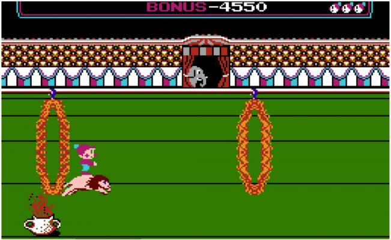
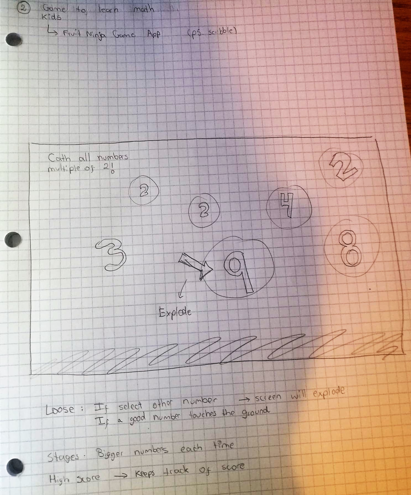

# Potential ideas
## Idea 1

* **Why are you making this project? What is your motivation?**  
When I was a kid, I used to play a game called Circus Charlie in Nintendo, I loved this game! Circus is about controlling a clown named Charlie to grab money bags, performing dangerous tricks, avoiding enemies, completing stages, etc. through 6 different stages.    
I loved this game! This is why  I want to make my own version of it for little kids as my niece and nephew to experience what I experienced as a kid. I could use the character "Trompita" that I created for my midterm and create the same sketchy environment. I would like to focus on one of the stages which was about riding on a lion and jumping through flaming rings (as shown in Image1). I will use elements as lives (hearts) and buttons to play and stop. I would also like to show fireworks when the player wins!. Image 2 shows a prototype of this idea.

Image 1:

Image 2:

* **What are your inputs?** 
  * The player could use the arrows on the keyboard to move Trompita and jump through the fire rings.
  * The player will click the buttons Play and Stop at any time during the game.

* **What are your outputs?** 
  * Trompita will jump when the up arrow is pressed. The more times the up arrow is consequently pressed, the higher Trompita will jump.
  * When the play button is pressed, the game will start.
  * When the stop button is pressed, the game will stop.
  * When Trompita touches one fire ring, he will loose a life and a heart will disappear.
  * Trompita has only 3 lives (3 hearts) until the game is over.

* **Who is the target audience for your project?**  
The target audience for my project are kids from 5 + years old. However, it could also be played by adults, as some games have become very popular within the millennial culture just  because of its simplicity.

* **Where will your project be displayed?** 
The game could be played in a tablet or computer.

## Idea 2

* **Why are you making this project? What is your motivation?**  
I played a mobile game app called Fruit Ninja for a long time ago. In the game, the player had to slice fruit that is thrown into the air by swiping the device's touch screen with their finger(s) (as shown in Image 3).
I want to mix a new version of this game with math and help little kids to learn math in a fun way. As shown in the prototype in Image 4, the game would have floating bubbles with numbers and the player will have different math challenges, for example, catching multiple numbers of 2 or sorting numbers by size, small to large. If the player catches the wrong number, then all bubbles will explode and the game will be over.

Image 3:

Image 4:

* **What are your inputs?**
  * The players will touch the screen with their fingers to pop the bubbles.

* **What are your outputs?**
  * When a bubble is touched it will disappear.
  * If the wrong bubble is touched the game will be over.
  * The player will see in the screen different challenges with instructions.

* **Who is the target audience for your project?** 
The target audience for my project are kids from 6 to 9 years old who are learning basic math. It is also the age when they are able to read and understand the instructions.

* **Where will your project be displayed?**  
The game could be displayed in big screens from stores or shopping malls. When parents are buying, kids could be playing this simple game while learning math. 

## Idea 3

* Why are you making this project? What is your motivation?
* What are your inputs?
* What are your outputs?
* Who is the target audience for your project?
* Where will your project be displayed?
