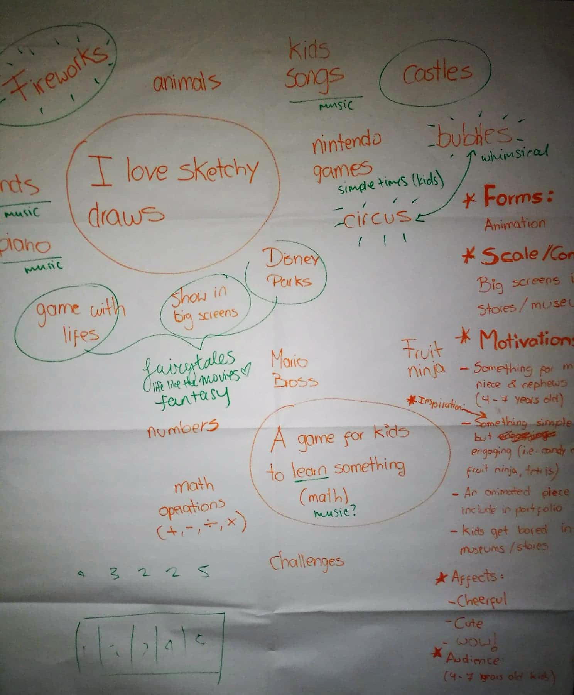
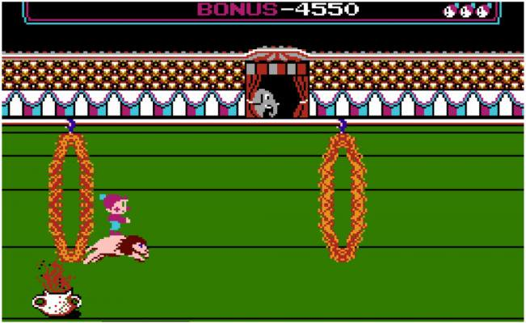
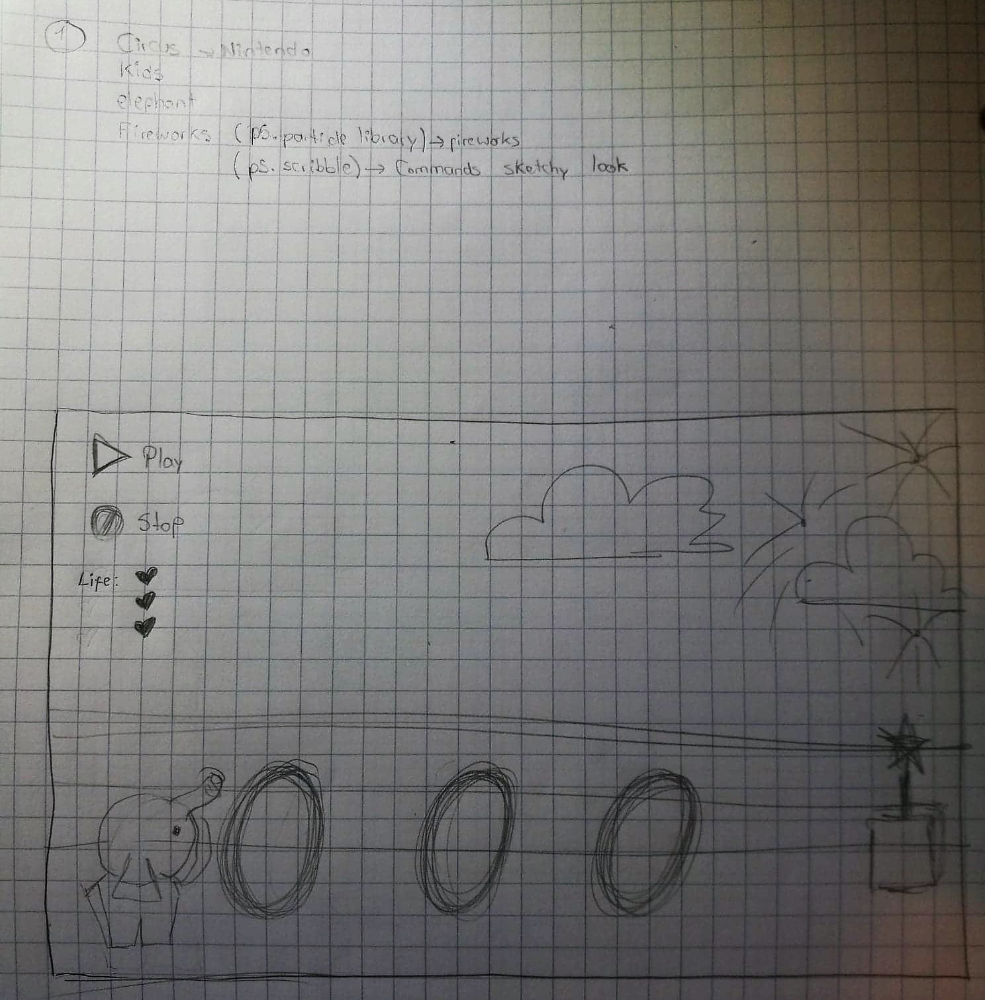
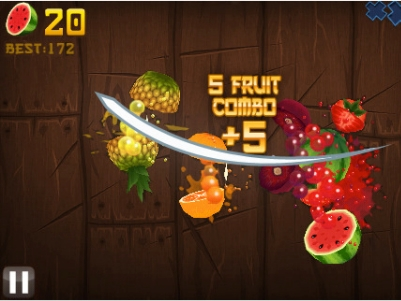
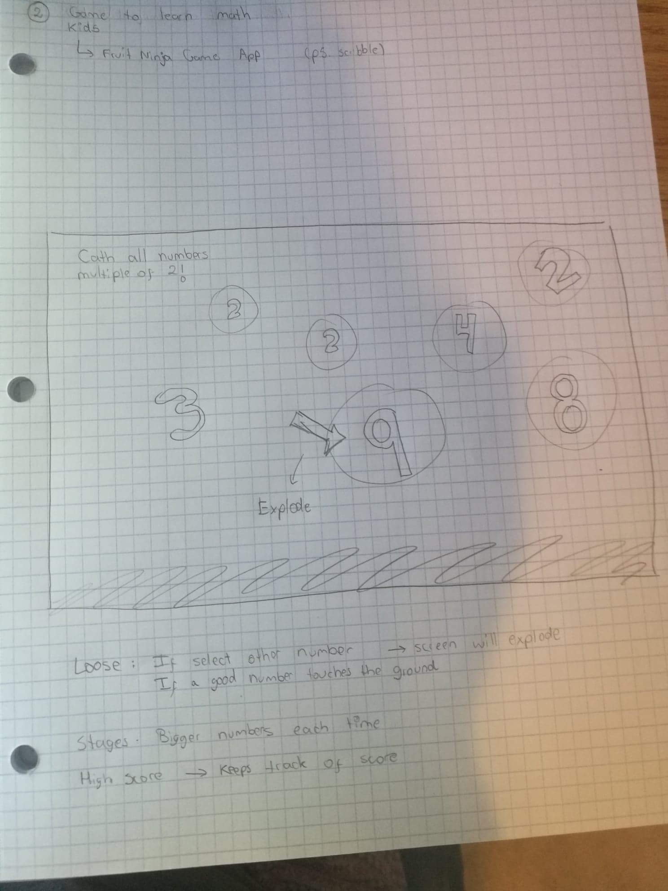
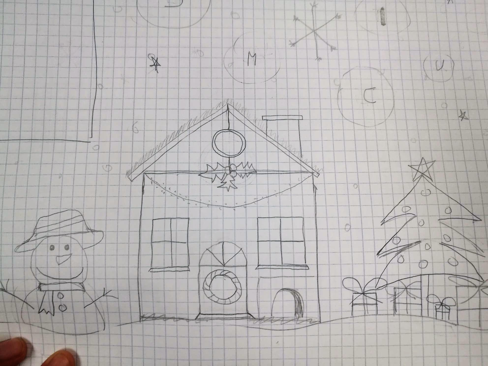
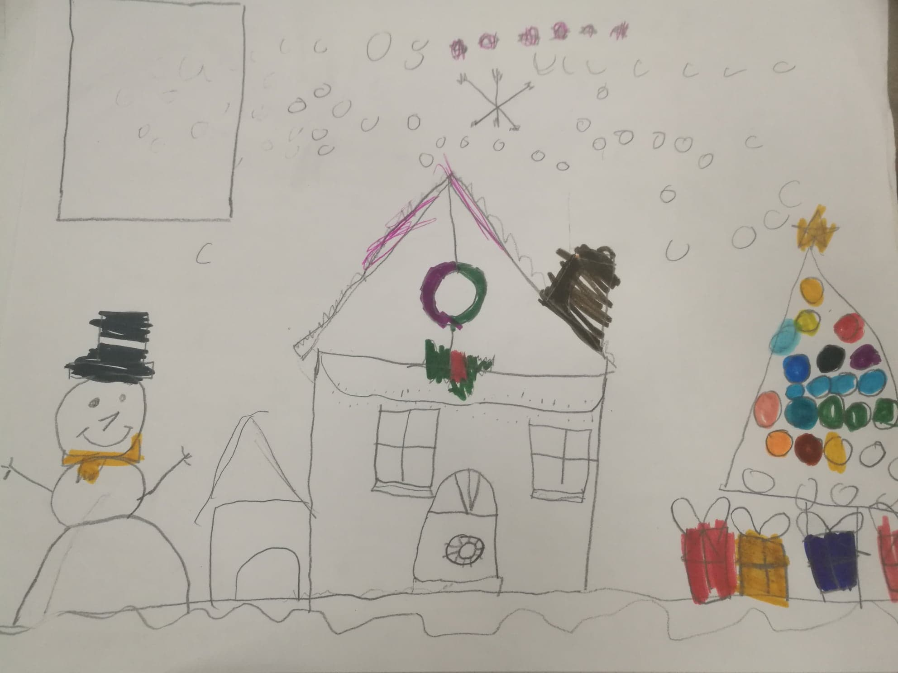

# My interactive Christmas card!
[Click here to play](https://mariaaguilarv.github.io/CIM-640-Creative-Coding/Hw/Final%20Project/index.html)

## Explanation
For this project, we had to use at least one library from p5js and make an interactive sketch.
In class, we had a final project ideation workshop (technique developed by Zannah Marsh & Marina Zurkow) where we all shared our ideas for our final project and we exchanged opinions. Image 1 shows my results from the workshop. This session was really helpful because I did not have any idea of what I wanted to do for my project and at the end I had some hints to be able to experiment and develop my ideas. Then Zeven asked us to document at least 3 ideas and precedents of what we wanted to develop ([click here to see my potential ideas](https://github.com/MariaAguilarV/CIM-640-Creative-Coding/tree/master/Hw/Final%20Project#potential-ideas)) and my winner idea was the third one, an interactive christmas card.

## Winner idea:

* **Why are you making this project? What is your motivation?**  
My favorite season of the year is Christmas! This is why I decided to make an interactive Christmas card combining my two previous ideas. It has different bubbles floating around and once they are touched different elements will be showing in the screen. A christmas tree will appear, then snow will come down, a snowman and christmas music will be played. I also want this game to be interactive for kids to enjoy it, so at the end of the game, the player will clap and see some surprise fireworks.
Furthermore, I added a gingerbread cookie to give instructions as he were talking and showing some fun messages to the player.
I also liked this idea because my niece (5 years old) loved it!

Developing my interactive christmas card has been a challenging project because with no previous experience on design tools, it took me a while to develop each single frame for my animations. Besides learning how to use libraries and make magic with p5js, with this project I also learnt to use Illustrator, isn't it awesome?

* **What are your inputs?**
  * Touch - The players will touch the screen with their fingers to pop up the bubbles.
  * Sound - At the end of the game, the player will have to clap to see fireworks in the screen.

* **What are your outputs?**
  * When a bubble is touched, it will disappear and a new element will be shown in the card. The letter "T" will show a tree, the letter "M" will play music, the letter "S" will show snow falling down, the letter "P" will show presents in the tree, and the letter "L" will change the night background and turn on the lights in the house and the tree.
  * To make my card funnier, when the letter "M" is touched and the music begins, some little gingerbread cookies will appear on the sides dancing.
  * At the end, an instruction will appear for the player to clap, it will track the intensity of the sound, and at one specific intensity, it will show fireworks in the sky.
  * When the fireworks start, the snow will stop in order to not overload the screen with animations.

* **Who is the target audience for your project?**  
My target audience are kids from 5 to 10 years old. However when I showed my project in class, some classmates told me that they would enjoy this short game as well, thus, this interactive card might be enjoyed by people from all ages!

* **Where will your project be displayed?**  
The game could be displayed in big screens from stores or shopping malls. When parents are buying, kids could be playing this simple game while learning math.

Image 1:

### Potential ideas
#### Idea 1

* **Why are you making this project? What is your motivation?**  
When I was a kid, I used to play a game called Circus Charlie in Nintendo, I loved this game! Circus is about controlling a clown named Charlie to grab money bags, performing dangerous tricks, avoiding enemies, completing stages, etc. through 6 different stages.    
I loved this game! This is why  I want to make my own version of it for little kids as my niece and nephew to experience what I experienced as a kid. I could use the character "Trompita" that I created for my midterm and create the same sketchy environment. I would like to focus on one of the stages which was about riding on a lion and jumping through flaming rings (as shown in Image2). I will use elements as lives (hearts) and buttons to play and stop. I would also like to show fireworks when the player wins!. Image 3 shows a prototype of this idea.

Image 2:

Image 3:

* **What are your inputs?** 
  * The player could use the arrows on the keyboard to move Trompita and jump through the fire rings.
  * The player will click the buttons Play and Stop at any time during the game.

* **What are your outputs?** 
  * Trompita will jump when the up arrow is pressed. The more times the up arrow is consequently pressed, the higher Trompita will jump.
  * When the play button is pressed, the game will start.
  * When the stop button is pressed, the game will stop.
  * When Trompita touches one fire ring, he will loose a life and a heart will disappear.
  * Trompita has only 3 lives (3 hearts) until the game is over.

* **Who is the target audience for your project?**  
The target audience for my project are kids from 5 + years old. However, it could also be played by adults, as some games have become very popular within the millennial culture just  because of its simplicity.

* **Where will your project be displayed?** 
The game could be played in a tablet or computer.

#### Idea 2

* **Why are you making this project? What is your motivation?**  
I played a mobile game app called Fruit Ninja for a long time ago. In the game, the player had to slice fruit that is thrown into the air by swiping the device's touch screen with their finger(s) (as shown in Image 4).
I want to mix a new version of this game with math and help little kids to learn math in a fun way. As shown in the prototype in Image 5, the game would have floating bubbles with numbers and the player will have different math challenges, for example, catching multiple numbers of 2 or sorting numbers by size, small to large. If the player catches the wrong number, then all bubbles will explode and the game will be over.

Image 4:

Image 5:

* **What are your inputs?**
  * The players will touch the screen with their fingers to pop the bubbles.

* **What are your outputs?**
  * When a bubble is touched it will disappear.
  * If the wrong bubble is touched the game will be over.
  * The player will see in the screen different challenges with instructions.

* **Who is the target audience for your project?** 
The target audience for my project are kids from 6 to 9 years old who are learning basic math. It is also the age when they are able to read and understand the instructions.

* **Where will your project be displayed?**  
The game could be displayed in big screens from stores or shopping malls. When parents are buying, kids could be playing this simple game while learning math.

#### Idea 3

* **Why are you making this project? What is your motivation?**  
My favorite season of the year is Christmas! This is why I decided to make an interactive Christmas card combining my two previous ideas. As shown in my prototype in Image 6, it will have different bubbles floating around and once they are touched different elements will be showing in the screen. A christmas tree will appear, then snow will come down, a snowman and christmas music will be played. I also want this game to be interactive for kids to enjoy it, so at the end of the game, the player will clap and see some surprise fireworks.

When thinking on this idea, I tried the paper prototyping with my little niece (5 years old) and she really liked the idea. Image 7 shows her draw.

Image 6:

Image 7:

* **What are your inputs?**
  * Touch - The players will touch the screen with their fingers to pop the bubbles.
  * Sound - At the end of the game, the player will have to clap to see fireworks in the screen.

* **What are your outputs?**
  * When a bubble is touched, it will disappear and a new element will be shown in the card. The letter "T" will show a tree, the letter "M" will play music, the letter "S" will show snow falling down, the letter "P" will show presents in the tree, and the letter "L" will change the night background and turn on the lights in the house.
  * At the end, an instruction will appear for the player to clap, it will track the intensity of the sound, and at one specific intensity it will show fireworks in the sky.

* **Who is the target audience for your project?**  
My target audience are kids from 5 to 7 years old.

* **Where will your project be displayed?**  
The game could be displayed in big screens from stores or shopping malls. When parents are buying, kids could be playing this simple game while learning math.
