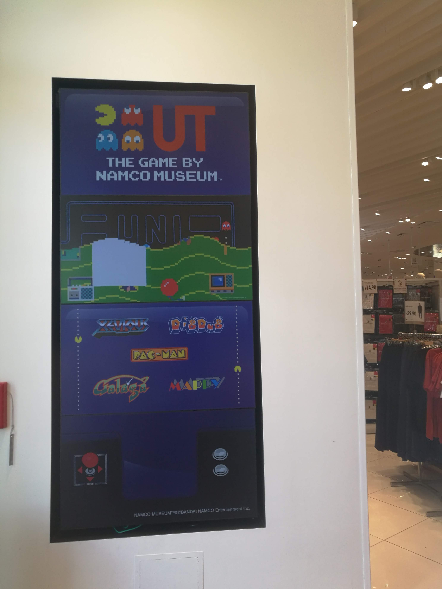
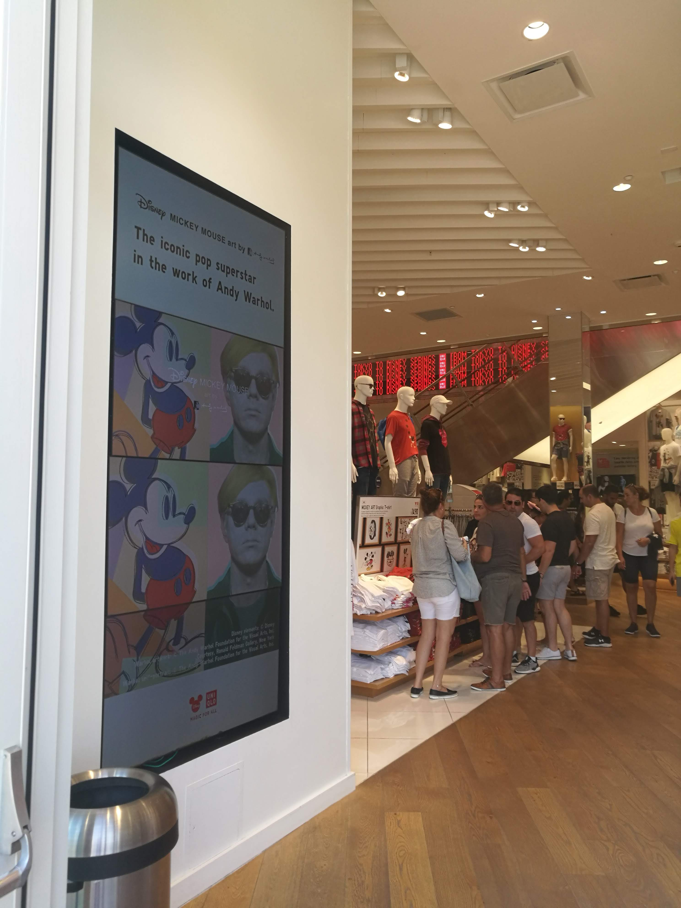

# Title
### Let's play with Trompita!

# Explanation:
* Why are you making this project? What is your motivation?
Going shopping with kids might be really challenging, angry parents and bored children are a common situation in stores, specially in clothes stores. The other day, I went shopping with my family and I saw these screens on some walls showing some random content, then I thought, why wouldn't they use these screens for interactive activities for kids?

The images below gave me the idea for this project. Although, it can be seen a game (pacman) showed in the screen, it wasn't interactive, thus I decided to create an easy animation for little kids. The main character of this story is "Trompita", the elephant's name of my nephew's favorite song. 

* What are your inputs?
  * Press each heart before they touch the ground
  * Press "try again" button
  * Press "play again" button

* What are your outputs?
  * Start game: Start animation of the balloon flying away
  * Hearts falling: Once the start animation finishes, it shows a random number of hearts from different sizes falling from top of screen
  * Heart touched: Disappear each little heart image when the user touches it
  * Lose game: Show screen of the character sad when one heart touches the ground.
  * Try again: Show try again button and restart the game when the user touches it.
  * Play again: Show play again button and restart the game when the user touches it.
  * Win game: Start final animation when all little hearts disappear.

* Who is the target audience for your project?
  My target audience are kids, specially from 3 to 7 years old, who tend to get bored easily. The game's simplicity and story will be a fun way to keep the little ones busy while parents are buying!

* Where will your project be displayed?
I would project this game in big screens in the wall of stores. I would use a screen as the one showed above.
